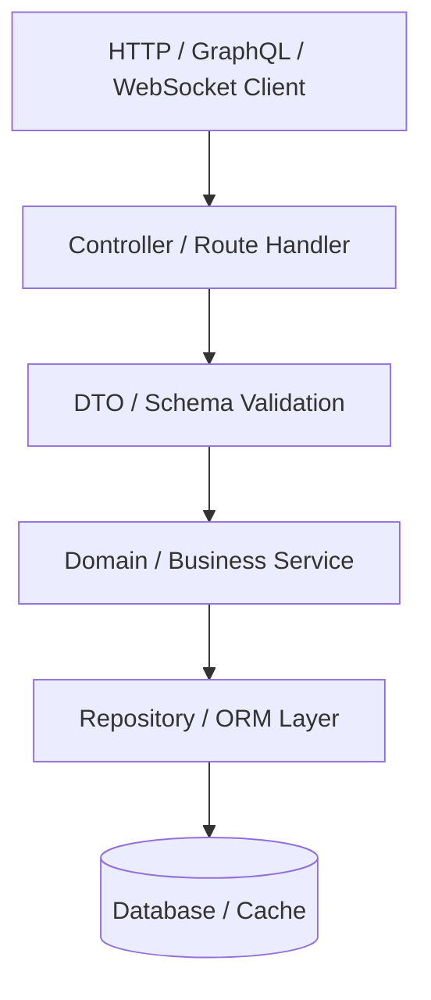
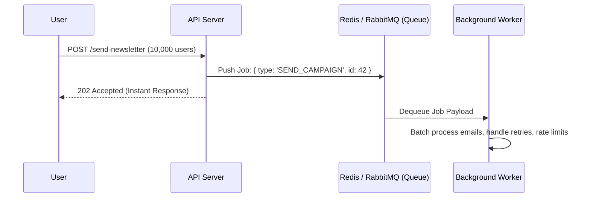

# Software Architecture Patterns for Junior Developers

> Real-world architectural patterns simplified using examples from popular open-source systems in this repository.

---

## 1. Layered & Clean Architecture

In almost every scalable backend repository (like NestJS, Twenty CRM, or FastAPI systems), code is segregated into strict layers of responsibility:



### Why It Matters
- **Controllers** only receive HTTP requests, parse inputs, and return HTTP responses. They contain **zero** business logic or database queries.
- **Services** encapsulate core business rules (e.g. calculating discounts, triggering emails, enforcing limits).
- **Repositories** insulate the business logic from the specific database being used. If you migrate from PostgreSQL to MySQL, only the repository changes.

---

## 2. Event-Driven Architecture & Async Task Queues

High-volume systems (e.g. **PostHog**, **Novu**, **Airbyte**) do not perform heavy workloads synchronously in the HTTP request loop.



### Key Takeaway for Juniors
Whenever an operation takes more than 100ms (sending emails, video transcoding, PDF generation, sync pipelines, AI embeddings), offload it to a background worker using libraries like **BullMQ** (Node.js), **Celery** (Python), or **Asynq** (Go).

---

## 3. Monorepo Structure (Turborepo & pnpm)

You will frequently encounter monorepos like **Cal.com**, **Documenso**, and **Dub.co**:

```
repo-root/
├── apps/
│   ├── web/           # Customer-facing Next.js application
│   ├── app/           # Authenticated user dashboard
│   ├── api/           # Backend REST/GraphQL server
│   └── docs/          # Docusaurus or Nextra documentation
├── packages/
│   ├── ui/            # Shared UI components (Tailwind, Radix, Shadcn)
│   ├── db/            # Database schema, Prisma client, migrations
│   ├── lib/           # Shared business logic and utility helpers
│   └── config/        # Shared ESLint, TypeScript, and Prettier configs
├── package.json
└── turbo.json
```

### Why Projects Use This
- Reusability of types and UI components across mobile, web, and internal admin panels.
- Atomic commits where frontend changes and database schema changes are merged in one pull request.

---

## 4. Multi-Tenancy & Row-Level Security (RLS)

SaaS projects (like **Supabase**, **Twenty CRM**, and **Chatwoot**) host thousands of organizations on shared infrastructure.

### The Two Common Models:
1. **Tenant ID Filtering (Application Level)**: Every table has an `organization_id` or `workspace_id`. ORMs append `WHERE organization_id = :current_tenant` to every query.
2. **PostgreSQL Row-Level Security (Database Level)**: As pioneered by Supabase, the database itself enforces that users can only read/write rows matching their authenticated JWT claims:
   ```sql
   CREATE POLICY "Users can only view their organization data"
   ON projects
   FOR ALL
   USING (organization_id = auth.jwt() ->> 'org_id');
   ```

---

## 5. Plugin & Modular Architecture

Enterprise systems like **Odoo**, **ERPNext**, and **Discourse** are built around modular extensible architectures:

- The core system provides extension hooks (lifecycle hooks, filters, event listeners).
- Third-party or custom modules can add new database tables, routes, and UI components without touching the core source code.
