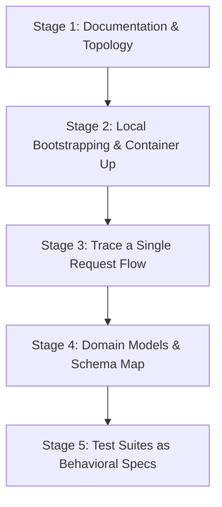
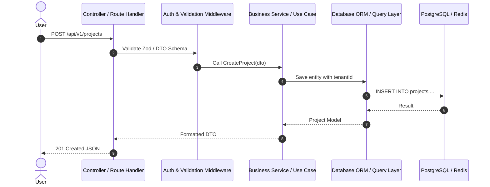

# The Junior Developer's Guide to Studying Open Source Codebases

> **"How do I read a 100,000-line repository without feeling overwhelmed?"**  
> This guide outlines a repeatable, 5-stage framework used by senior engineers to dissect, understand, and learn architectural patterns from real-world production codebases.

---

## 🧭 The Core Mindset

When you open a production repository like Supabase, PostHog, or Twenty CRM, your goal is **not** to read every line of code sequentially like a novel.

Instead, think of a large codebase like a bustling city:
- You don't memorize every brick.
- You identify the major highways (routing & data flow), the power grid (configuration & dependency injection), and the delivery docks (APIs, databases, and message queues).

---

## 🪜 The 5-Stage Reconnaissance Framework

### Stage 1: Topology & Monorepo Reconnaissance
Before looking at business logic, inspect the root directory to understand the project anatomy.

1. **Check the package manager & workspace configuration**:
   - `pnpm-workspace.yaml`, `lerna.json`, `turbo.json`, or `nx.json` indicate a **monorepo**.
   - Look into `apps/` (runnable applications, frontend web, backend API) vs `packages/` (reusable shared libraries, UI component libraries, database clients, utilities).
2. **Find the Entry Points**:
   - Web frontend: `apps/web/src/main.tsx`, `app/layout.tsx` (Next.js App Router), or `pages/_app.tsx`.
   - Backend API: `apps/api/src/main.ts`, `cmd/server/main.go`, `main.py`, or `src/index.ts`.
3. **Inspect the Environment Variables**:
   - Check `.env.example` to see external integrations (Redis, PostgreSQL, S3, OpenAI, Stripe, OAuth providers).

---

### Stage 2: Bootstrapping via Docker
The fastest way to see how components communicate is by studying their container composition:

- Open `docker-compose.yml` or `docker-compose.dev.yml`.
- List each service:
  - What database is used? (PostgreSQL, ClickHouse, Redis, MongoDB, Vector DB)
  - Are there background workers? (Celery, BullMQ, Sidekiq, Temporal)
  - Is there an API gateway or reverse proxy? (Caddy, NGINX, Traefik)
- Running `docker compose up` allows you to observe initial database migrations and boot logs in your terminal.

---

### Stage 3: Trace a Single "Happy Path" HTTP Request
Pick **one concrete action** a user can take (e.g., *User signs up*, *Creates a project*, or *Sends a message*) and follow the code end-to-end:

1. **Route definition**: Find where `/api/v1/...` is registered.
2. **Validation layer**: How are inputs sanitized? (Zod, Pydantic, class-validator).
3. **Service layer**: Where does the business logic live? Notice how the service avoids direct HTTP objects (`req`, `res`).
4. **Data Access layer**: How does it talk to the DB? (Prisma, Drizzle, SQLAlchemy, GORM, raw SQL).

---

### Stage 4: Map the Data Model (The Spine of the System)
Understanding the database schema provides 70% of the context on what the business actually does.

- **Prisma**: Check `schema.prisma`
- **Drizzle**: Check `schema.ts`
- **SQLAlchemy / Alembic**: Check `models/` or `migrations/`
- **Go / GORM**: Check `internal/models/`

**Key questions to answer:**
- What is the primary multi-tenancy model? (Does every table have an `organization_id` or `workspace_id`?)
- How are user roles and permissions structured? (RBAC vs ABAC).
- What are the core entities, and how are relationships mapped (1:1, 1:N, N:M)?

---

### Stage 5: Learn from the Test Suite
Production test suites are the best documentation because they illustrate *expected behavior*:

- Look in `tests/e2e/` (Playwright, Cypress) to see real user workflows simulated in code.
- Look in `*.spec.ts` or `test_*.py` unit/integration tests to see how services are invoked and mocked.
- Notice how mock factories (`userFactory.build()`) set up isolated test states.

---

## 🛠️ Practical Tools to Supercharge Code Exploration

| Tool | Purpose | How to Use |
| :--- | :--- | :--- |
| **GitHub `github.dev` (Press `.`)** | Instant Web VS Code | Open any repository on GitHub and press `.` on your keyboard to browse files with full syntax highlighting. |
| **GitHub Symbol Search (`Ctrl+T` or `Cmd+T`)** | Jump to Function/Class Definition | Search directly for interface, class, or method names across files. |
| **Sourcegraph / grep.app** | Cross-Repository Search | Search how top production repositories implement specific hooks, libraries, or patterns. |
| **Docker & Dev Containers** | Zero-Config Local Setup | Use `.devcontainer` configurations to spin up isolated environments with all dependencies pre-installed. |

---

## 🎯 Suggested First Projects to Read

If you are just getting started:
1. **[PocketBase](https://github.com/pocketbase/pocketbase)** *(Go)*: Exceptionally clean, single-binary architecture with embedded SQLite.
2. **[Umami](https://github.com/umami-software/umami)** *(TypeScript/Next.js)*: Clean, modern full-stack web application with Prisma and lightweight event collection.
3. **[Cal.com](https://github.com/calcom/cal.com)** *(TypeScript/Next.js)*: Industry benchmark for modern Turborepo monorepo architectures and complex scheduling math.
4. **[FastAPI](https://github.com/fastapi/fastapi)** *(Python)*: Beautiful Pythonic codebase demonstrating type hints, dependency injection, and automatic OpenAPI generation.
